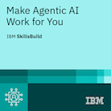

# Hi, I'm Moyed

CS Student | Aspiring AI Engineer  
Building software projects and improving AI skills

  

---

## Connect With Me

---

## Tech Stack

---

## Certificates

---

## Currently Exploring

- AI Engineering
- MLOps & Automation
- Self-Hosted AI Systems
- Building Software Projects
- Learning Modern AI Technologies

